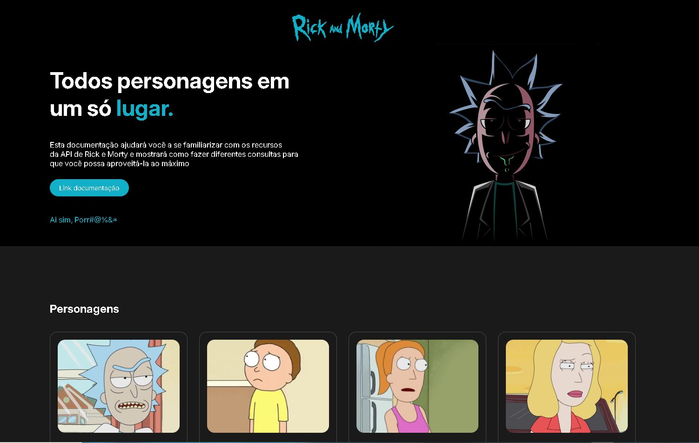

# 🛸 Rick and Morty Explorer

Aplicação que consome a [Rick and Morty API](https://rickandmortyapi.com/) para exibir informações sobre personagens da série, como nome, imagem, espécie e status de vida. Projeto feito com HTML, CSS e JavaScript, utilizando `async/await` para chamadas assíncronas à API.

---

## 🖼️ Demonstração



---

## 🚀 Tecnologias Utilizadas

- ✅ **HTML5**
- ✅ **CSS3**
- ✅ **JavaScript**
- ✅ **Fetch API com Async/Await**
- ✅ **Rick and Morty REST API**

---

## 📦 Como Usar

1. Clone o repositório:

```bash
git clone https://github.com/rafael-mauricio/rick-and-morty-api.git
